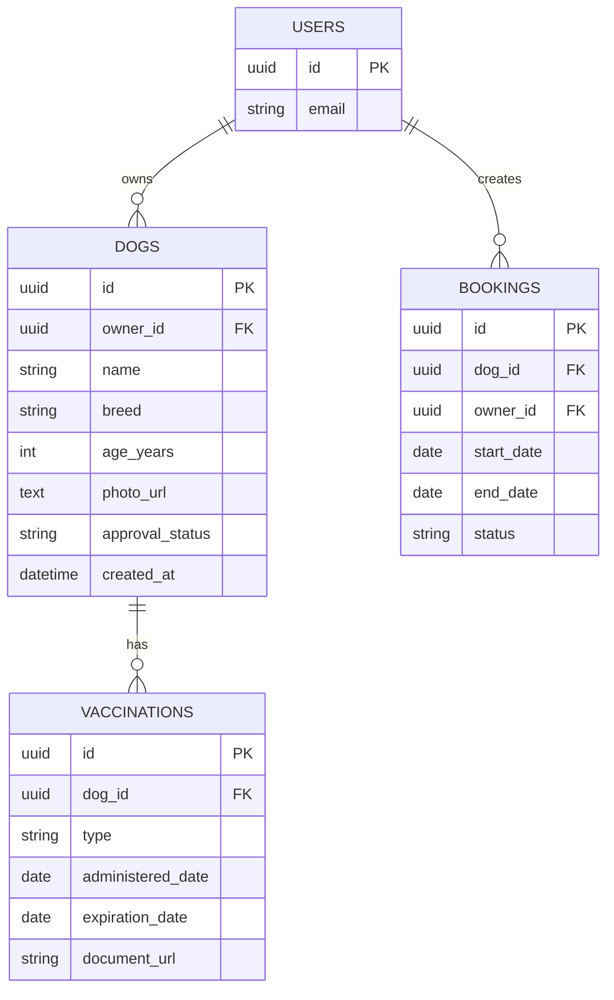

**Technical overview**  
We will extend the existing **Camp Pawesome Web** Next.js application (React 18 + Next.js 14) that already consumes Supabase (Auth, Storage, Postgres) to add a fully‑digital owner‑dog registration workflow. The new feature will reside inside the same repository, using the same `src/` structure, Supabase schema, and deployment pipeline. It will expose a wizard‑style registration page, a set of server‑protected API routes, and an admin portal for reviewing and approving submissions. Vaccination records will be stored in Supabase Storage with associated metadata in a new **vaccinations** table; the dog record will carry a `approval_status` flag. Email notifications to owners will be triggered via a Supabase Edge function called from the approval API.

---

## System components

| Component | Responsibility |
|-----------|------------------|
| `/register` pages | Multi‑step wizard for owners and dogs, form validation, photo & vaccination uploads. |
| API routes `/api/register` | Server‑side SaaS—accepts form data, interacts with Supabase client, stores records, returns status. |
| `supabase/schema.sql` (updated) | Adds `vaccinations` table and `dogs.approval_status`; defines enabling RLS policies for admin and user access. |
| `admin` portal (`/admin/registrations`) | Lists pending dog registrations; allows viewing vaccination uploads; approves or rejects; triggers email confirmations. |
| Supabase Edge function `sendApprovalEmail` | Sends templated email via an email provider (e.g., SendGrid) when a registration is approved. |
| Storage bucket `dog-photos` | Already present, extended for vaccination documents `dog-vaccinations`. |
| `lib/supabaseClient.ts` | Shared Supabase client instance with server‑side credentials, used by all API routes. |
| Post‑gather‑really | Markdown/HTML email templates (if needed). |

---

## Technology stack (existing repo)

| Layer | Technology | Rationale |
|-------|------------|-----------|
| Web framework | **Next.js 14** | Existing app architecture; supports API routes, server‑side rendering, and static generation. |
| UI library | **React 18 + TailwindCSS** | Current project uses Tailwind; new UI components can be styled consistently. |
| Backend & DB | **Supabase (Postgres, Auth, Storage)** | Already bootstrapped; RLS policies available for fine‑grained access control. |
| Serverless functions | **Supabase Edge Functions** | Provides a lightweight way to run code (email) without setting up separate backend. |
| CI/CD | **GitHub Actions** (implied by .github/) | Existing repository likely already configured. |

---

## Data model

```sql
-- New table for vaccination records
CREATE TABLE IF NOT EXISTS vaccinations (
  id            uuid PRIMARY KEY DEFAULT gen_random_uuid(),
  dog_id        uuid REFERENCES dogs(id) ON DELETE CASCADE NOT NULL,
  type          text NOT NULL CHECK (type IN ('rabies', 'bordetella', 'dhpp')),
  administered_date date NOT NULL,
  expiration_date   date NOT NULL,
  document_url      text, -- URL in dog-vaccinations bucket
  uploaded_at      timestamptz DEFAULT now(),
  created_at       timestamptz DEFAULT now()
);
```



---

## Implementation steps

### 1. Extend the database schema
- Add `vaccinations` table above.
- Add `approval_status` column to `dogs` (`varchar` with values `pending|approved|rejected`).
- Create an `admin_users` role or simply rely on `auth.role()` being `org_admin` (setup via Supabase settings); enforce policy:

```sql
CREATE POLICY "Admins view all dogs" ON dogs FOR SELECT USING (
  auth.role() = 'org_admin' OR auth.uid() = owner_id
);
```

### 2. Storage buckets
- Create `dog-vaccinations` bucket (private to owners, public to view if approved).
- Leverage Supabase `storage` client in API routes to upload files, returning signed URLs.

### 3. API routes

| Path | Method | Purpose |
|------|--------|---------|
| `/api/register/step1` | POST | Persist owner profile (uses Supabase Auth session). |
| `/api/register/step2` | POST | Create dog record (owner_id). |
| `/api/register/step3` | POST | Upload vaccination document; create `vaccinations` row. |
| `/api/register/complete` | POST | Set `dogs.approval_status='pending'`; enqueue email to admin. |
| `/api/admin/registrations` | GET | List pending dogs (admin only). |
| `/api/admin/registrations/[id]/approve` | POST | Set `approval_status='approved'`; send email. |
| `/api/admin/registrations/[id]/reject` | POST | Set `approval_status='rejected'`; send email with explanation. |

These routes use **server‑side Supabase client** (imported from `lib/supabaseClient.ts`) to bypass CORS and keep private keys safe.

### 4. UI

#### Registration wizard (`/register`)
- **Step 1** – Owner contact info (Phone, Email, Emergency). Pre‑fill from Auth user meta.
- **Step 2** – Dog list: dynamic add/remove card for each dog; each card contains name, breed, age, spay/neuter, allergies, medical conditions, temperament notes, storage photo upload, optional vet contact.
- **Step 3** – Vaccination: file input (PDF/JPG) per dog; type selection; validation of expiration timestamp.
- **Step 4** – Preferred start date: date picker or pre‑defined slots picker (no need for full schedule yet).
- **Step 5** – Review & submit. On submit, JSON multipart POST to `/api/register/complete`.

All forms use `react-hook-form` + Tailwind for validation and responsiveness. Error messages shown inline.

#### Admin portal (`/admin/registrations`)
- Dashboard table listing pending dogs with columns: Dog Name, Owner, Uploaded Docs count, Submitted Date.
- Row expansion: shows dog details, vaccination THUMBNAILS (trust signed URLs), link to original owner profile.
- Action buttons: Approve / Reject (opens modal for optional message).
- Upon action, calls API routes above; edge function triggers email.

### 5. Email notifications

Create a Supabase Edge function `sendApprovalEmail()`:

```ts
import { serve } from 'std/server'
import { createClient } from '@supabase/supabase-js'
import sgMail from '@sendgrid/mail'

serve(async (req, { params }) => {
  const { dogId, action } = await req.json()
  // fetch dog, owner info
  // send email via SendGrid; use environment var SENDGRID_API_KEY
  return new Response('ok', { status: 200 })
})
```

The API approval route triggers this function asynchronously (fetch call). No blocking.

### 6. Deployment

- Use the repo’s existing GitHub Actions workflow (`.github/workflows/*`) to build and deploy Next.js + Supabase.
- Store edge function code in `supabase/functions/sendApprovalEmail`.

### 7. Testing

- Unit tests for API routes (`jest`, `supertest`).
- E2E tests using Cypress for wizard flow and admin actions.
- Verify RLS policies by attempting unauthorized access during tests.

---

## Non‑functional considerations

| Consideration | Implementation |
|---------------|------------------|
| **Performance** | Pagination on admin list (`limit`/`offset`), server‑side image optimization via next/image if needed. |
| **Security** | RLS policies enforce that only owners can see their own data, admins can see all. Sensitive docs stored in private bucket, URLs expire after short period. |
| **Scalability** | Supabase handles scaling automatically; the new tables and edge function are lightweight. |
| **Compliance** | Personal data (owner contact, dog health) stored per GDPR/CCPA; ensure Supabase’s data residency selection (EU/US). |
| **Accessibility** | Form components use semantic labels, ARIA attributes; color contrast follows Tailwind's palette. |
| **Error handling** | API routes return consistent JSON `{ success, error }`. Front‑end shows toast notifications. |

---

**Open questions**

- Does the existing Supabase project use a custom `org_admin` role or the built‑in `auth.role()`? We’ll assume a role exists; if not, we’ll need to create it or use email patterns to identify admins.
- What email provider should be used? (SendGrid, AWS SES, etc.) We suggest SendGrid due to its free tier and clear Supabase integration.
- Are there any vaccination handling rules beyond expiration (e.g., minimum dog age, required boosters)? We’ll add obvious checks (age ≥ 3 months for rabies) in the API route; any additional rules can be entered as business logic.

---